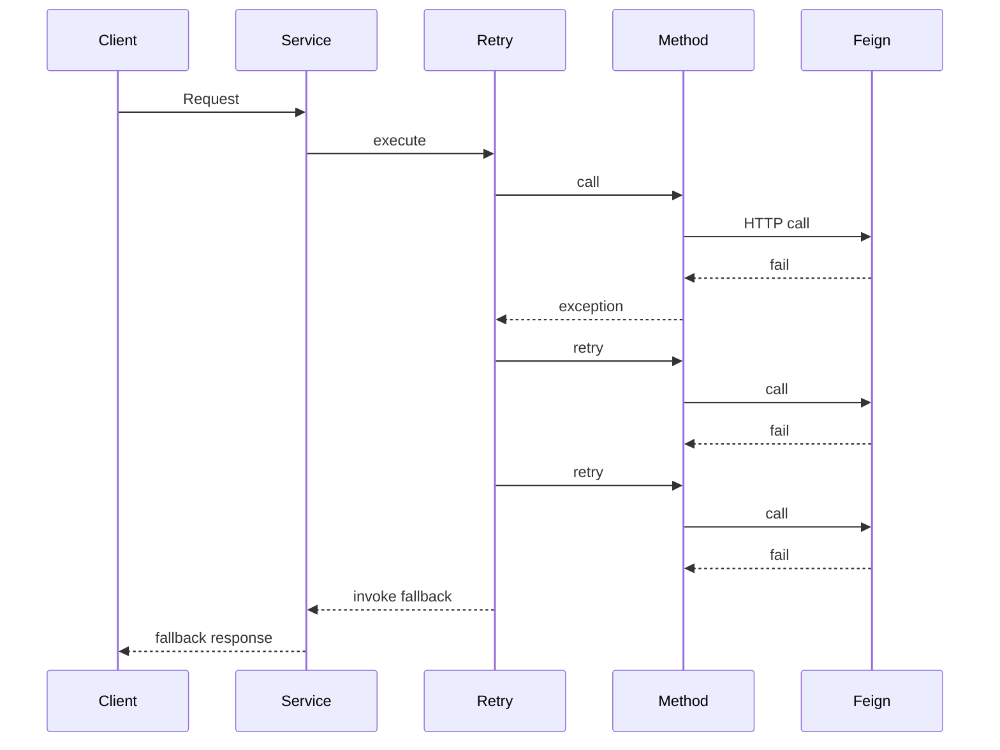
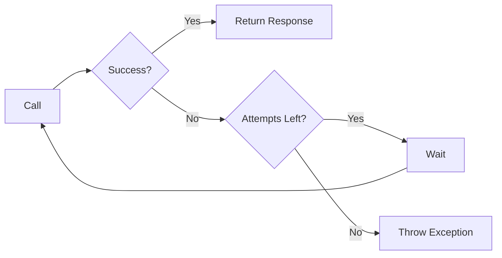
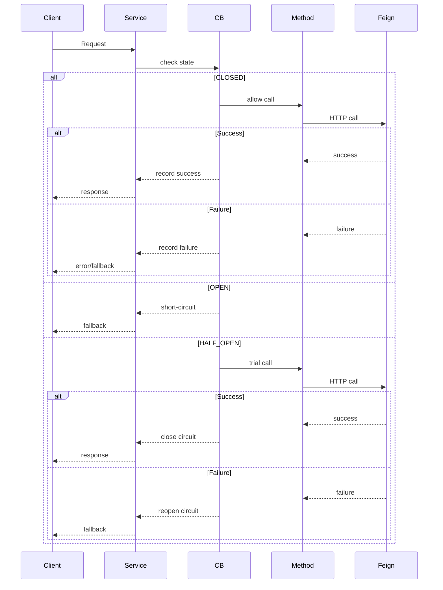
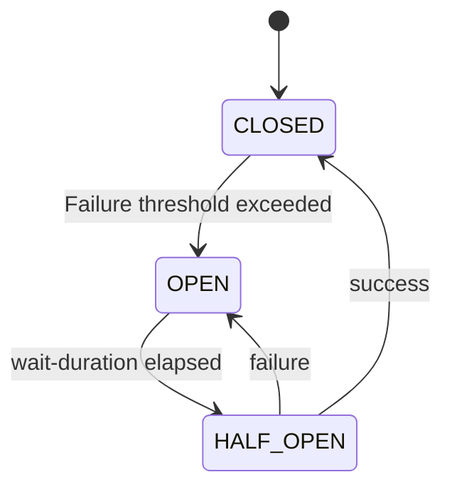
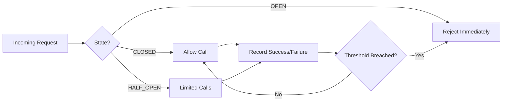
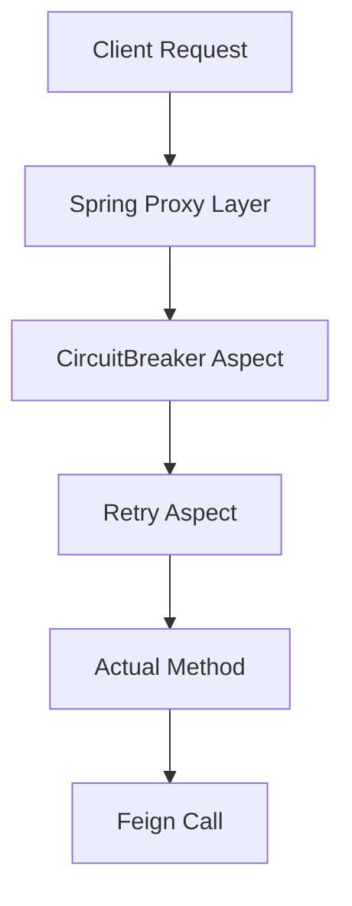
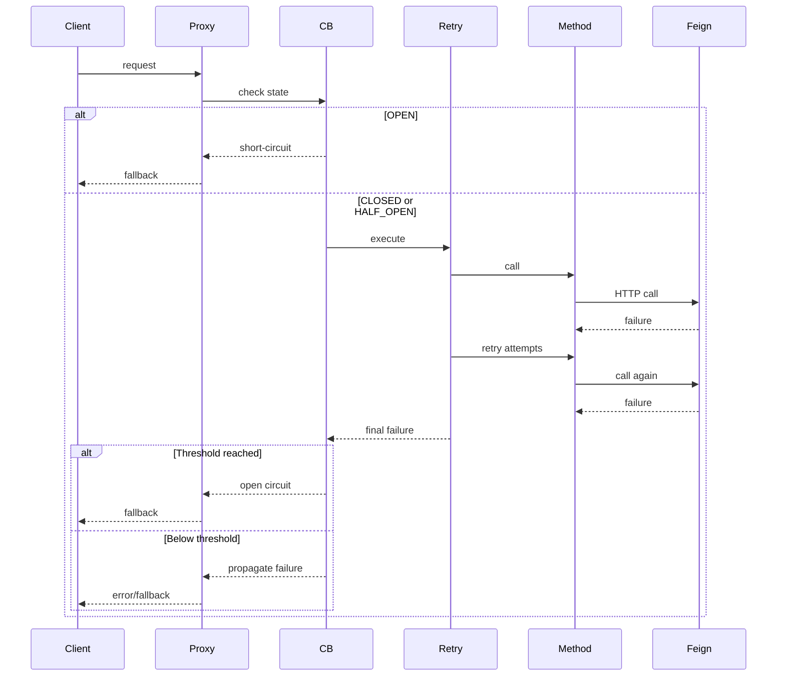
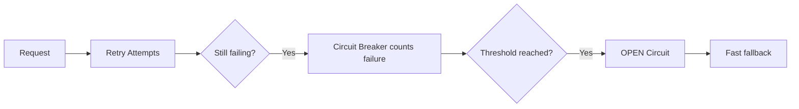

# Resilience4j — Practical + Deep Dive Guide

---

# 🧩 PART 1 — RETRY (ISOLATED)

## 📌 What Retry Does

Retry handles **temporary/transient failures** by re-attempting a failed operation.

👉 Think:

> "Maybe it’ll work if I try again"

---

## ⚙️ Retry Configuration

```yaml
resilience4j:
  retry:
    instances:
      callerServiceRetry:
        max-attempts: 3
        wait-duration: 2s
```

---

## 🔄 Retry Flow



---

## ⚡ Retry Behavior

* Total attempts = **3 (1 original + 2 retries)**
* Wait time between retries = **2s**
* Retries on configured exceptions (default: all RuntimeExceptions)
* After max attempts → fallback (if defined) or exception propagates

---

## 🧠 Internal Mechanism



---

## 🚨 Limitations of Retry

* Can **spam failing service**
* Adds **latency**
* No awareness of system health

---

# 🔌 PART 2 — CIRCUIT BREAKER (ISOLATED)

## 📌 What Circuit Breaker Does

Circuit Breaker stops calls when failures are frequent.

👉 Think:

> "Stop trying, system is broken"

---

## ⚙️ Circuit Breaker Configuration

```yaml
resilience4j:
  circuitbreaker:
    instances:
      callerServiceRetry:
        sliding-window-size: 3
        failure-rate-threshold: 50
        wait-duration-in-open-state: 10s
        permitted-number-of-calls-in-half-open-state: 2
```

---

## 🔄 Circuit Breaker Flow



---

## 🔌 State Machine



---

## ⚡ Circuit Breaker Behavior

* Monitors last **N calls (sliding window)**
* Opens when **failure % > threshold**
* Blocks all calls when OPEN
* Allows limited test calls in HALF_OPEN

---

## 🧠 Internal Mechanism



---

## 🚨 Benefits

* Prevents system overload
* Enables **fast failure (zero latency)**
* Protects downstream services

---

# ⚡ PART 3 — COMBINING RETRY + CIRCUIT BREAKER

## 🧠 Key Idea

> Retry = handle temporary failures     
> Circuit Breaker = handle repeated failures

---

## ⚠️ Execution Order (Critical)

```java
@Retry(name = "callerServiceRetry")
@CircuitBreaker(name = "callerServiceRetry", fallbackMethod = "fallback")
public String failableMethod() {
    return callerClient.simulateFailing();
}
```

Default Resilience4J aspect order:
* ```Retry( CircuitBreaker( RateLimiter( TimeLimiter( Bulkhead( function)))))```
* Override it so that the CB fallback is given after Retry tries again and again and fails
```yaml
resilience4j:
    retry:
        retryAspectOrder: 2
        # Rest of the config
    circuitbreaker:
        circuitBreakerAspectOrder: 1
        # Rest of the config
```

---

## 🔥 AOP Proxy Chain



---

## 🔄 Combined Flow



---

## ⚡ Combined Behavior

* Retry happens **first**
* Circuit Breaker sees **final result**
* After enough failures → Circuit opens
* When OPEN:

  * ❌ No Retry
  * ❌ No Feign call
  * ✅ Immediate fallback

## How the failures are actually recorded in the window of CB here?
* CB records the whole result of the 3 retry attempts as one:
    * E.g.: Retry [fail, fail, fail] (3 fails) --> CB [FAIL] (1 FAIL)
    * And 50% of 3 (~2) such failures in the window OPENs the circuit
* Other CB recording scenarios here:
    * E.g.: Retry [success] (1 success) --> CB [SUCCESS] (1 SUCCESS)
    * E.g.: Retry [fail, success] (1 fail, 1 success) --> CB [SUCCESS] (1 SUCCESS)
---

## ⏱️ Timing Behavior

* OPEN → stays for **10s**
* Then HALF_OPEN
* Allows **2 test calls**
* Decides whether to:
  * CLOSE ✅
  * OPEN again ❌

---

## 🧠 Final Mental Model



---

## ⚡ Key Takeaways

* Retry = "Try again"
* Circuit Breaker = "Stop trying"
* Retry is **outer layer**
* Circuit Breaker is **inner layer**
* Order matters due to **AOP proxy chain**
* When OPEN → system fails **fast and safely**

---

## 🧠 Golden Rule

> "If you don't understand the proxy chain, you don't understand Resilience4j."
