# Resilience4j — Practical + Deep Dive Guide

---

# 🔁 PART 1 — RETRY

## 📌 What Retry Does

Retry handles **temporary/transient failures** by re-attempting a failed operation.

👉 Think:

> "Maybe it’ll work if I try again"

---

## ⚙️ Retry Configuration

```yaml
resilience4j:
  retry:
    instances:
      callerServiceRetry:
        max-attempts: 3
        wait-duration: 2s
```

---

## 🔄 Retry Flow

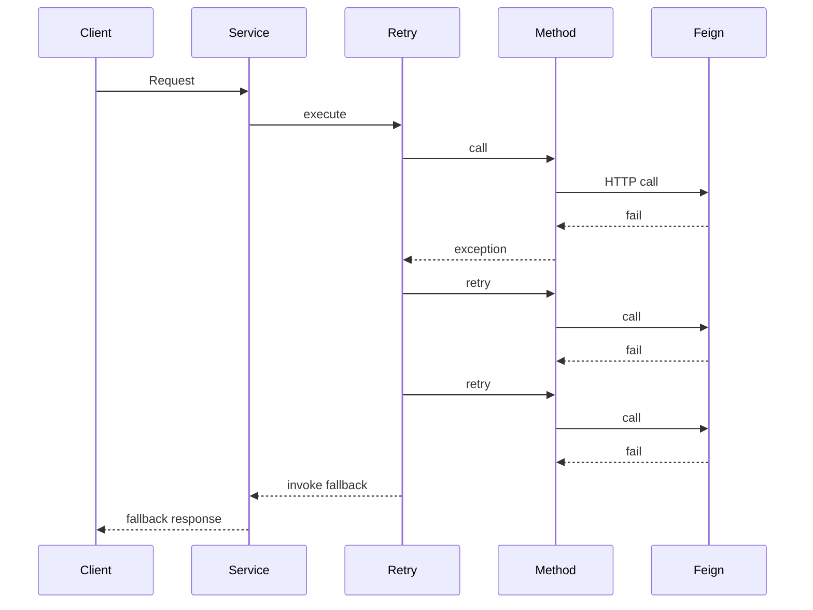

---

## ⚡ Retry Behavior

* Total attempts = **3 (1 original + 2 retries)**
* Wait time between retries = **2s**
* Retries on configured exceptions (default: all RuntimeExceptions)
* After max attempts → fallback (if defined) or exception propagates

---

## 🧠 Internal Mechanism

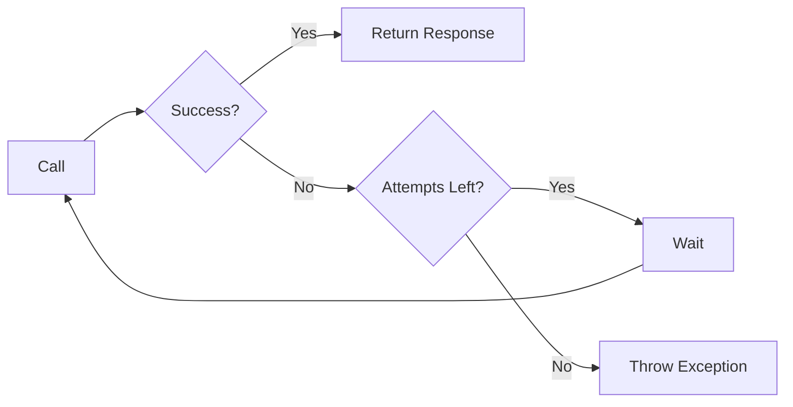

---

## 🚨 Limitations of Retry

* Can **spam failing service**
* Adds **latency**
* No awareness of system health

---

# 🔌 PART 2 — CIRCUIT BREAKER

## 📌 What Circuit Breaker Does

Circuit Breaker stops calls when failures are frequent.

👉 Think:

> "Stop trying, system is broken"

---

## ⚙️ Circuit Breaker Configuration

```yaml
resilience4j:
  circuitbreaker:
    instances:
      callerServiceRetry:
        sliding-window-size: 3
        failure-rate-threshold: 50
        wait-duration-in-open-state: 10s
        permitted-number-of-calls-in-half-open-state: 2
```

---

## 🔄 Circuit Breaker Flow

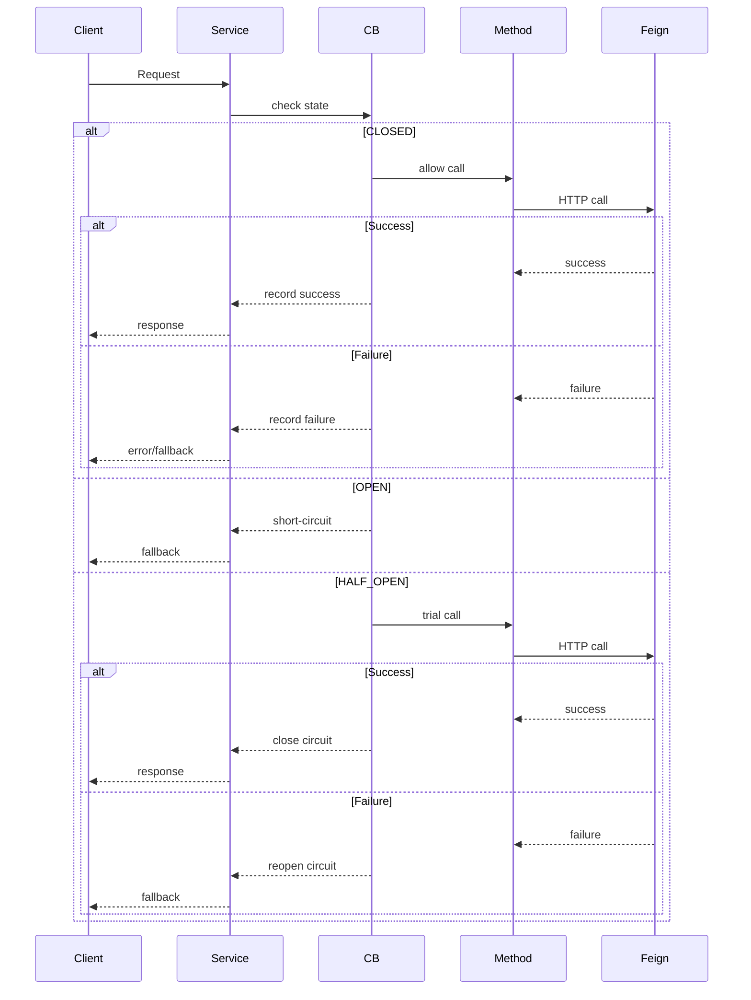

---

## 🔌 State Machine

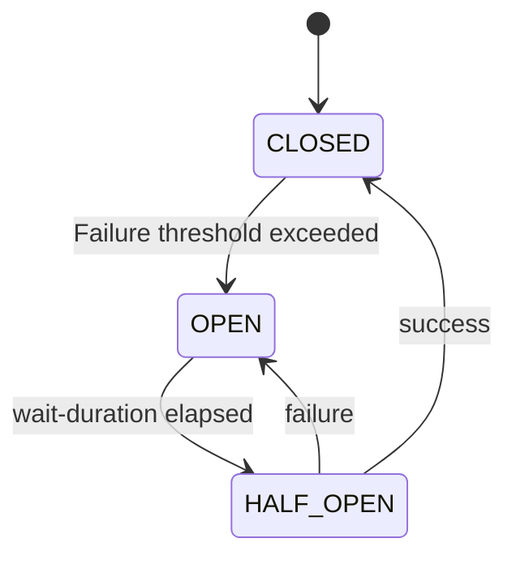

---

## ⚡ Circuit Breaker Behavior

* Monitors last **N calls (sliding window)**
* Opens when **failure % > threshold**
* Blocks all calls when OPEN
* Allows limited test calls in HALF_OPEN

---

## 🧠 Internal Mechanism

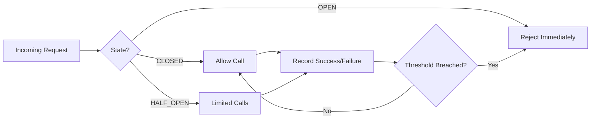

---

## 🚨 Benefits

* Prevents system overload
* Enables **fast failure (zero latency)**
* Protects downstream services

---

# ⚡ PART 3 — COMBINING RETRY + CIRCUIT BREAKER

## 🧠 Key Idea

> Retry = handle temporary failures     
> Circuit Breaker = handle repeated failures

---

## ⚠️ Execution Order (Critical)

```java
@Retry(name = "callerServiceRetry")
@CircuitBreaker(name = "callerServiceRetry", fallbackMethod = "fallback")
public String failableMethod() {
    return callerClient.simulateFailing();
}
```

Default Resilience4J aspect order:
* ```Retry( CircuitBreaker( RateLimiter( TimeLimiter( Bulkhead( function)))))```
* Override it so that the CB fallback is given after Retry tries again and again and fails
```yaml
resilience4j:
    retry:
        retryAspectOrder: 2
        # Rest of the config
    circuitbreaker:
        circuitBreakerAspectOrder: 1
        # Rest of the config
```

---

## 🔥 AOP Proxy Chain

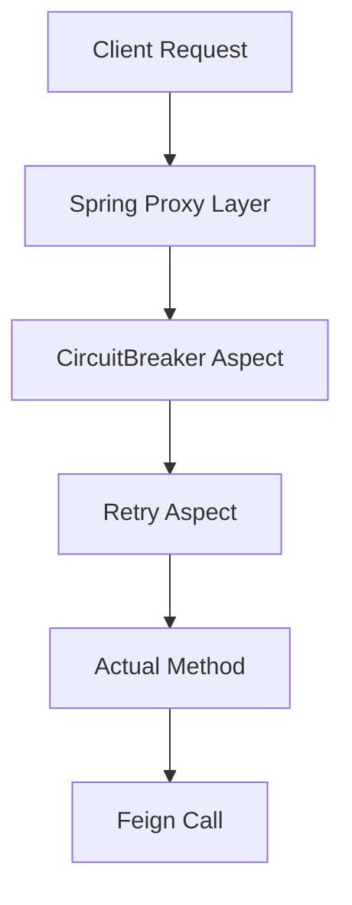

---

## 🔄 Combined Flow

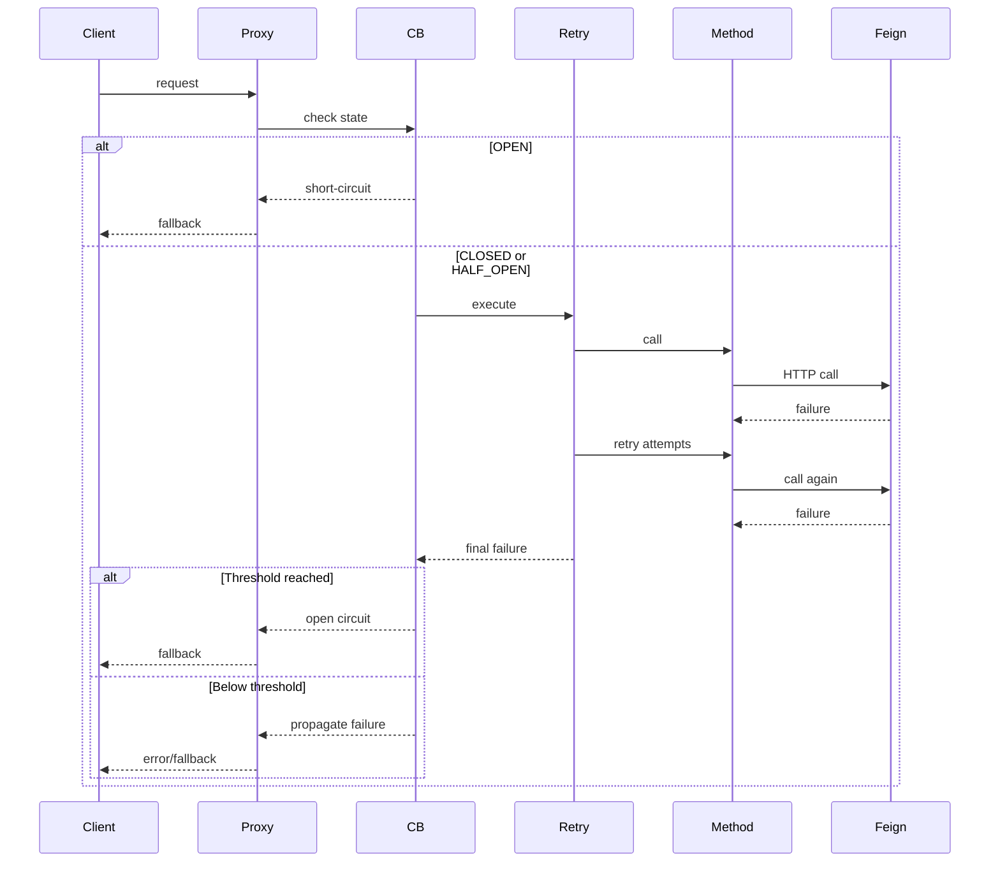

---

## ⚡ Combined Behavior

* Retry happens **first**
* Circuit Breaker sees **final result**
* After enough failures → Circuit opens
* When OPEN:

  * ❌ No Retry
  * ❌ No Feign call
  * ✅ Immediate fallback

## How the failures are actually recorded in the window of CB here?
* CB records the whole result of the 3 retry attempts as one:
    * E.g.: Retry [fail, fail, fail] (3 fails) --> CB [FAIL] (1 FAIL)
    * And 50% of 3 (~2) such failures in the window OPENs the circuit
* Other CB recording scenarios here:
    * E.g.: Retry [success] (1 success) --> CB [SUCCESS] (1 SUCCESS)
    * E.g.: Retry [fail, success] (1 fail, 1 success) --> CB [SUCCESS] (1 SUCCESS)
---

## ⏱️ Timing Behavior

* OPEN → stays for **10s**
* Then HALF_OPEN
* Allows **2 test calls**
* Decides whether to:
  * CLOSE ✅
  * OPEN again ❌

---

## 🧠 Final Mental Model

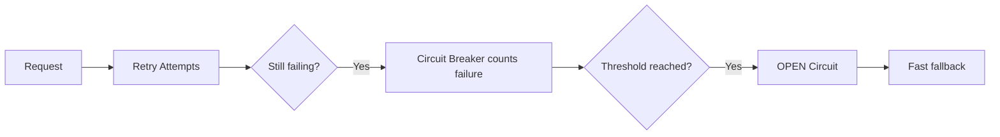

---

## ⚡ Key Takeaways

* Retry = "Try again"
* Circuit Breaker = "Stop trying"
* Retry is **outer layer**
* Circuit Breaker is **inner layer**
* Order matters due to **AOP proxy chain**
* When OPEN → system fails **fast and safely**

---

## 🧠 Golden Rule

> "If you don't understand the proxy chain, you don't understand Resilience4j."

---

# 🚦 PART 4 - RATE LIMITER

## ⚡ Core Idea
A **RateLimiter** controls how many requests can execute in a given time window.

```
limit-for-period: 5
limit-refresh-period: 10s
```

👉 Means:
- Only **5 executions allowed every 10 seconds**
- After 10s → permits reset

---

## 🔑 What is a Permit?

A **permit** = permission to execute your method.

```
permit = "you are allowed to run now"
```

- 5 permits → only 5 requests can run in that window
- Once used → NOT returned when thread finishes
- Reset only on next window

---

## ❗ Key Rule (MOST IMPORTANT)

```
Permits are NOT released when threads finish
Permits reset ONLY with time
```

---

## 🧠 Thread Behavior

Each request (thread) does:

```
try acquire permit
    ↓
if success → execute method
if fail → wait (timeout-duration)
    ↓
if still no permit → fallback()
```

---

## ⚙️ Your Code

```java
@RateLimiter(name = "myRateLimiter", fallbackMethod = "fallback2")
public String demonstrateRateLimiter() {
    try {
        Thread.sleep(Duration.ofSeconds(1));
    } catch (InterruptedException e) {
        e.printStackTrace();
    }
    System.out.println("Number of method invocations: " 
        + CallerService.numberOfInvocations.incrementAndGet());
    return "Sample Rate Limiter Response";
}

public String fallback2(Exception e) {
    System.out.println("------------------------------- Rate Limiter Fallback -------------------------------");
    return "Rate Limiter demo failed: " + e.getMessage();
}
```

---

## ⚙️ Config

```yaml
rateLimiter:
  instances:
    myRateLimiter:
      limit-for-period: 5
      limit-refresh-period: 10s
      timeout-duration: 3s
```

---

## 🧪 Mental Model

Each thread has:

```
arrival_time
deadline = arrival_time + timeout
```

And it asks:

```
Did I get a permit before my deadline?
```

---

## 📊 Timeline Example

### Setup:
- 11 requests
- limit = 5
- timeout = 3s
- window = 10s

### Flow:

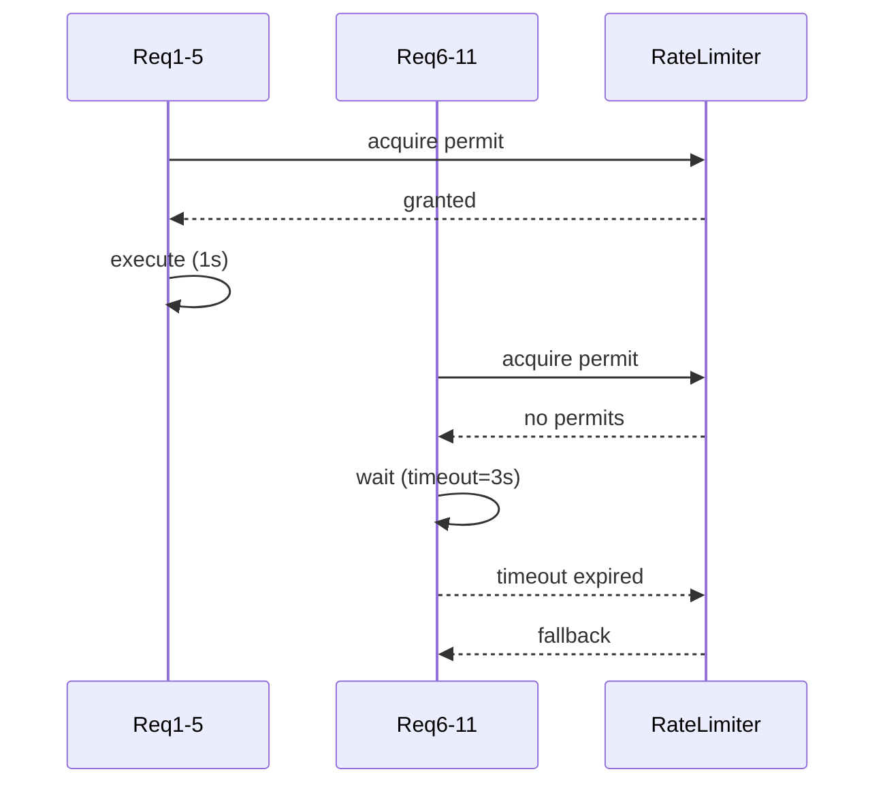

---

## 🧠 Why Some Requests Succeed Later

Because:

```
Threads can "wait" for future permits
```

If they survive long enough → they execute

If not → fallback

---

## 🔥 Negative Permits (Internal)

```
0 → no permits
-1 → one thread waiting
-2 → two threads waiting
```

👉 Means:
threads are reserving future execution slots


---

## ⚡ ApacheBench (-c)

```bash
ab -n 11 -c 5 <url>
```

👉 Means:
- Only 5 concurrent requests
- Others are delayed

So requests are NOT truly simultaneous

---

## 🔥 Real Behavior

```
Requests are spread across time windows
```

So:

```
Success = permits_per_window × windows_reached
```

---

## ⚠️ Timeout Purpose

```
timeout-duration = max wait time for a permit
```

- small → fail fast
- large → wait longer
- too large → thread pile-up risk

---

## 🧠 Thread Lifecycle
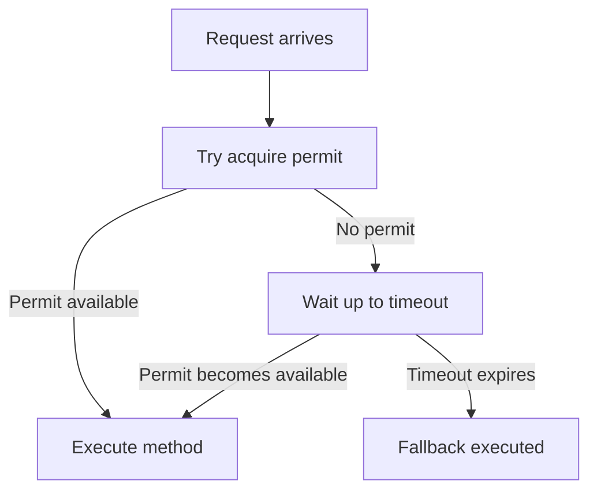
---

## 🔥 Key Insights

### 1. Not concurrency control
RateLimiter ≠ Semaphore

### 2. Time-based, not execution-based
Completion doesn’t free permits (only the window refresh does)

### 3. Each request is independent
No batches internally

### 4. It's a race against time
Not a queue

---

## ⚡ One-Liners

- Permit = one execution slot in time window
- Timeout = how long you're willing to wait
- Fallback = thread lost the race
- RateLimiter = time-based token system

---

## 🧠 Final Mental Model

```
Threads race against:
    - permit availability
    - timeout deadline
    - window reset
```

---

## 🧃 Analogy

Juice shop:

- 5 juices per 10 min
- people can wait (timeout)
- if they wait long enough → get juice
- else → leave (fallback)

---

# ⏳ PART 5 - TIME LIMITER

## 🧠 What TimeLimiter Does

TimeLimiter ensures that a caller **does not wait longer than a
configured duration**.

-   It does **NOT** guarantee stopping execution
-   It **times out the caller**, not the worker thread

------------------------------------------------------------------------

## ⚙️ Configuration (Spring Boot YAML)

``` yaml
resilience4j:
  timelimiter:
    instances:
      myTimeLimiter:
        timeoutDuration: 3s
        cancelRunningFuture: true
```

### Key Properties

-   `timeoutDuration`: Max wait time
-   `cancelRunningFuture`: Calls `future.cancel(true)` on timeout

------------------------------------------------------------------------

## 🧵 How It Works

1.  Method returns `CompletableFuture`
2.  TimeLimiter starts timer
3.  If task completes in time → success
4.  If not:
    -   Throws `TimeoutException`
    -   Calls `future.cancel(true)` (if enabled)

------------------------------------------------------------------------

## 🔁 Execution Flow

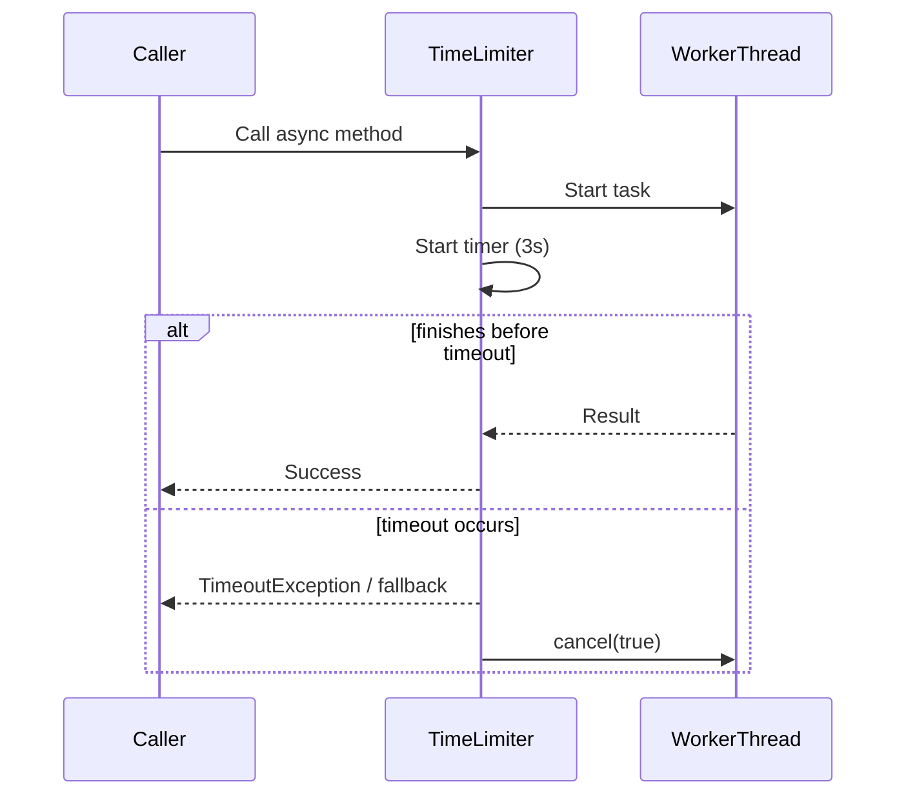

------------------------------------------------------------------------

## ⚠️ Important: Cancellation is Cooperative

`future.cancel(true)`: - Sends interrupt signal - DOES NOT force kill
thread

### Correct handling

``` java
try {
    Thread.sleep(5000);
} catch (InterruptedException e) {
    Thread.currentThread().interrupt();
    return "Cancelled";
}
```

### Wrong handling

``` java
catch (InterruptedException e) {
    // ignore
}
```

------------------------------------------------------------------------

## ❗ Common Pitfalls

### 1. Using wrong fallback signature

❌ Incorrect:

``` java
public void fallback()
```

✅ Correct:

``` java
public CompletableFuture<String> fallback(Throwable t)
```

------------------------------------------------------------------------

### 2. Using commonPool for blocking tasks

Default:

``` java
CompletableFuture.supplyAsync(...)
```

Uses: - ForkJoinPool.commonPool()

❌ Not suitable for blocking calls

------------------------------------------------------------------------

### 3. Ignoring interrupts

Leads to: - Threads continue running - Unexpected completions

------------------------------------------------------------------------

## ✅ Best Practices

-   Use custom executor:

``` java
ExecutorService executor = Executors.newFixedThreadPool(5);

// Usage
CompletableFuture.supplyAsync(() -> methodThatTakesTime(), executor);
```

-   Handle interrupts properly
-   Combine with:
    -   Bulkhead (limit threads)
    -   CircuitBreaker (stop failures)

------------------------------------------------------------------------

## 🧠 Mental Model

TimeLimiter says: \> "I will not wait longer than X time"

NOT: \> "I will stop the work"

------------------------------------------------------------------------

## 🧾 Summary

  Aspect           | Behavior
  -----------------| ----------------------------
  Timeout          | Stops waiting
  Cancellation     | Best-effort interrupt
  Thread stopping  | Not guaranteed
  Return type      | CompletableFuture required
  Fallback         | Must match signature

------------------------------------------------------------------------

## 🔥 Final Insight

TimeLimiter controls **latency**, not **execution**.

---

## 🔄 Difference vs Other Resilience4j Components
### 🔁 Retry
- Re-attempts failed calls
### 🔌 CircuitBreaker
- Stops calls when failures high
### 🚦 RateLimiter
- Controls traffic volume, not failures
### ⏳ TimeLimiter
- Times out the caller thread